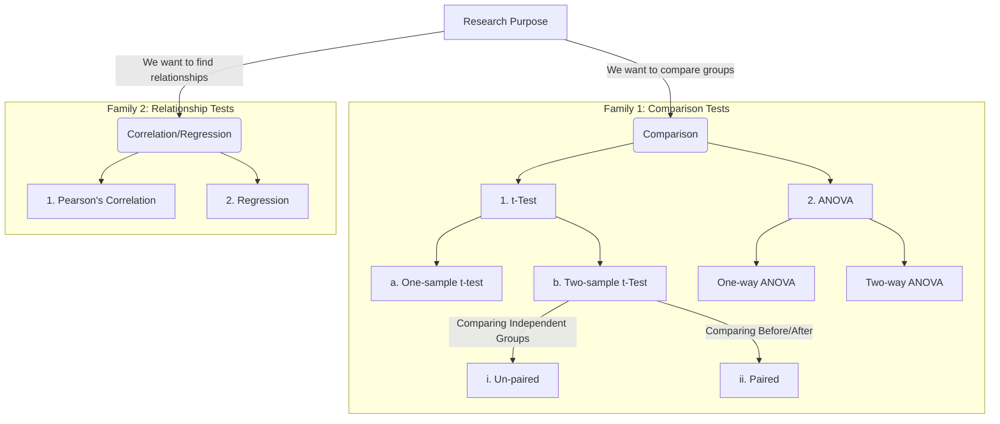
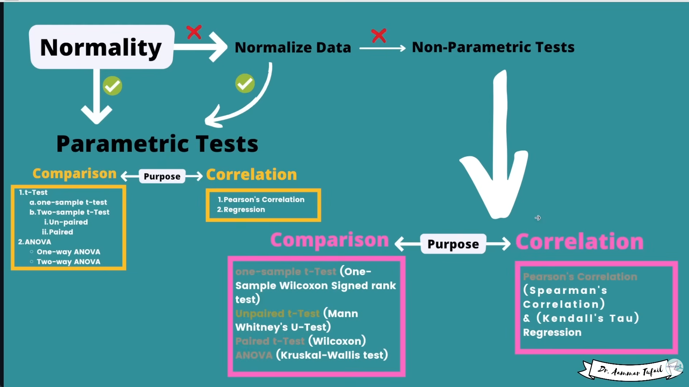

<!-- @format -->

# Codanics

# Levels of Measurement: A Statistical Hierarchy

This document outlines the four levels of measurement used in statistics to help determine which mathematical operations and statistical tests are appropriate for a given dataset.

---

## Table of Contents

1. [Nominal Level](#1-nominal-level-labels)
2. [Ordinal Level](#2-ordinal-level-order)
3. [Interval Level](#3-interval-level-fixed-spacing)
4. [Ratio Level](#4-ratio-level-the-gold-standard)
5. [Summary Comparison](#summary-comparison-table)

---

## 1. Nominal Level (Labels)

> **Definition:** Used for **categorizing** or labeling variables without any quantitative value or internal order. You can only calculate the _mode_ and _frequencies_.

- **Eye Color:** Brown, Blue, Green, Hazel.
- **Blood Type:** A, B, AB, O.
- **Marital Status:** Single, Married, Divorced, Widowed.
- **Binary Outcomes:** Yes/No, Pass/Fail.

---

## 2. Ordinal Level (Order)

> **Definition:** Data has a **specific order or rank**, but the "distance" between the ranks is unknown or inconsistent.

- **Satisfaction Surveys:** Very Unsatisfied, Neutral, Very Satisfied.
- **Socioeconomic Status:** Low income, Middle income, High income.
- **Race Results:** Gold, Silver, and Bronze medals. (The time gap between medals varies).
- **Education Level:** High School, Bachelor’s, Master’s, PhD.

---

## 3. Interval Level (Fixed Spacing)

> **Definition:** Data has a **meaningful order** and the **intervals between values are equal**. However, it lacks a "true zero"—zero is just a placeholder.

- **Temperature (Celsius/Fahrenheit):** 20°C to 30°C is the same gap as 30°C to 40°C. 0°C doesn't mean "no heat."
- **IQ Scores:** The difference between 100 and 110 is the same as 110 and 120.
- **Dates:** The year 0 is a point in time, not the "absence of time."

---

## 4. Ratio Level (The "Gold Standard")

> **Definition:** Includes all properties of the previous levels plus a **true zero point**. This allows for statements like "twice as much" or "half as many."

- **Physical Dimensions:** Height, Weight, and Length. (0 kg = no weight).
- **Income:** $0 means no money earned.
- **Time:** Measured in seconds, minutes, or hours from a starting point.
- **Age:** Measured in years from the point of birth (0).

---

## Summary Comparison Table

| Level        | Categorizes? | Orders? | Equal Intervals? | True Zero? |
| :----------- | :----------: | :-----: | :--------------: | :--------: |
| **Nominal**  |      ✅      |   ❌    |        ❌        |     ❌     |
| **Ordinal**  |      ✅      |   ✅    |        ❌        |     ❌     |
| **Interval** |      ✅      |   ✅    |        ✅        |     ❌     |
| **Ratio**    |      ✅      |   ✅    |        ✅        |     ✅     |

# Statistical Concepts: Triangulation

This document provides an overview of **Triangulation** in research and statistics, covering its types, advantages, and limitations.

---

## What is Triangulation?

**Triangulation** is the practice of using multiple methods, data sources, investigators, or theories to study a single phenomenon. By approaching a research question from different angles, researchers can cross-verify results and increase the reliability of their findings.

### Types of Triangulation

1. **Methodological:** Combining different methods (e.g., surveys + focus groups).
2. **Data:** Collecting data from different times, spaces, or persons.
3. **Investigator:** Using multiple researchers to observe and analyze the same data.
4. **Theoretical:** Using different theoretical perspectives to interpret a single set of data.

---

## Pros and Cons Analysis

### Advantages (Pros)

| Feature               | Benefit                                                                                            |
| :-------------------- | :------------------------------------------------------------------------------------------------- |
| **Enhanced Validity** | Corroborating evidence from different sources makes the findings more credible.                    |
| **Rich Nuance**       | Provides a more complete picture (e.g., Quantitative shows _trends_, Qualitative shows _reasons_). |
| **Reduced Bias**      | Offsets the inherent weaknesses or biases of a single method or researcher.                        |
| **Discovery**         | Contradictions between data sources can lead to new, unexpected insights.                          |

### Disadvantages (Cons)

| Feature            | Drawback                                                                                 |
| :----------------- | :--------------------------------------------------------------------------------------- |
| **High Cost**      | Requires more funding, tools, and participants than single-method studies.               |
| **Time-Consuming** | Data collection and analysis phases take significantly longer.                           |
| **Complexity**     | Integrating divergent data types (like numbers vs. text) can be technically difficult.   |
| **Conflict**       | Results may contradict each other, making it hard to form a single, cohesive conclusion. |

---

## Summary Checklist for Research

- [ ] Is the research question complex enough to require multiple methods?
- [ ] Do I have the resources (time/budget) for triangulation?
- [ ] Have I defined how I will reconcile conflicting data points?
- [ ] Are the chosen methods independent enough to provide a fresh perspective?

---

_Created for the Research Methods documentation project._

---

# Surrogate Endpoints in Statistics

A **Surrogate Endpoint** is an outcome measure that is used as a proxy for a clinically meaningful endpoint.

## Definition

- **Clinical Endpoint:** Reflects a patient's feelings, functions, or survival (e.g., "Did the patient live?").
- **Surrogate Endpoint:** A biomarker intended to substitute for a clinical endpoint (e.g., "Did their blood sugar drop?").

---

## Comparison Table

| Feature       | Clinical Endpoint          | Surrogate Endpoint           |
| :------------ | :------------------------- | :--------------------------- |
| **Goal**      | Direct measure of benefit  | Indirect measure of benefit  |
| **Timeframe** | Long-term                  | Short-term                   |
| **Ease**      | Difficult/Expensive        | Easy/Cheaper                 |
| **Accuracy**  | High (The "Gold Standard") | Variable (Must be validated) |

---

## Common Examples

1. **Cardiovascular:** Using _Blood Pressure_ as a surrogate for _Stroke/Heart Attack_.
2. **Oncology:** Using _Progression-Free Survival (PFS)_ as a surrogate for _Overall Survival (OS)_.
3. **Diabetes:** Using _HbA1c levels_ as a surrogate for _Microvascular complications_.

---

## Key Risks

> **Warning:** A surrogate endpoint is only useful if it is **validated**. If a drug improves the surrogate but doesn't improve the patient's life or lifespan, the trial is considered a failure in a clinical sense.

---

# Bias in Data: Statistical Overview

**Bias** is a systematic distortion in data that leads to inaccurate conclusions. In statistics, it is the difference between the "Expected Value" of an estimator and the "True Value" of the parameter being studied.

---

## Common Types of Bias

### 1. Selection Bias

- **Definition:** The sample is not representative of the population.
- **Example:** Sampling only daytime shoppers to represent all consumers.

### 2. Recall Bias

- **Definition:** Participants do not remember past events accurately.
- **Example:** Asking people what they ate exactly three weeks ago.

### 3. Non-Response Bias

- **Definition:** When people who choose _not_ to respond have different characteristics than those who do.
- **Example:** An employee satisfaction survey where unhappy employees are too afraid to participate.

### 4. Exclusion Bias

- **Definition:** Systematically excluding certain groups from the dataset.
- **Example:** A clinical trial that excludes elderly patients but applies the drug to all ages.

---

## How to Mitigate Bias

- [ ] **Random Sampling:** Ensure every member of a population has an equal chance of being selected.
- [ ] **Blind Studies:** Prevent researchers or participants from knowing which group is the control.
- [ ] **Data Auditing:** Regularly check datasets for under-represented groups.
- [ ] **Clear Definitions:** Use objective, standardized measurements to reduce human error.

---

> "The first principle is that you must not fool yourself—and you are the easiest person to fool." — Richard Feynman

[https://codanics.com/measurement-bias/](https://codanics.com/measurement-bias/)

---

# Measurement Bias (Systematic Error)

Measurement bias is a systematic flaw in the data collection process that consistently distorts the measurement of a variable.

## Key Types

1. **Instrumental:** Faulty equipment (e.g., uncalibrated sensors).
2. **Respondent:** Participants lying to look better (Social Desirability).
3. **Observer:** The researcher sees what they want to see.
4. **Proxy:** Using a poor surrogate (e.g., using "hours spent in gym" as a proxy for "actual calories burned").

---

## The "Bullseye" Visualization

- **Low Bias + Low Random Error:** Hits the center of the target every time.
- **High Bias + Low Random Error:** Hits a tight cluster, but far away from the center (Reliably Wrong).
- **Low Bias + High Random Error:** Scattered all over the target, but the average is the center.

---

## Prevention Strategies

- [ ] **Calibration:** Regularly test equipment against a known standard.
- [ ] **Blinding:** Use double-blind studies so researchers don't know which group is which.
- [ ] **Anonymity:** Ensure surveys are anonymous to reduce social desirability bias.
- [ ] **Standard Operating Procedures (SOPs):** Use strict scripts and protocols for all data collectors.

---

## [https://codanics.com/data-analysis-and-types-of-data-analysis/](https://codanics.com/data-analysis-and-types-of-data-analysis/)

# Data Analysis and Its Four Types

Data Analysis is the systematic application of statistical and logical techniques to describe, illustrate, and evaluate data.

## The Maturity Model

### 📊 1. Descriptive Analysis

> **Goal:** Summarize what occurred.

- **Metric:** "How many units did we sell?"
- **Key Tools:** Dashboards, Pie Charts, Tables.

### 🔍 2. Diagnostic Analysis

> **Goal:** Understand the "why."

- **Metric:** "Why did our website traffic drop last Tuesday?"
- **Key Tools:** Correlation, Probability, Regression.

### 🔮 3. Predictive Analysis

> **Goal:** Forecast future trends.

- **Metric:** "Which customers are likely to cancel their subscription next month?"
- **Key Tools:** Machine Learning, Trend Lines.

### 💡 4. Prescriptive Analysis

> **Goal:** Determine the best path forward.

- **Metric:** "What is the optimal delivery route to save fuel?"
- **Key Tools:** Optimization Algorithms, AI Simulations.

---

## Analysis Workflow

1. **Data Requirements:** Define what you are measuring.
2. **Data Collection:** Gathering info from various sources.
3. **Data Cleaning:** Removing "garbage" data (outliers/errors).
4. **Data Analysis:** Applying the types listed above.
5. **Visualization:** Turning numbers into charts for stakeholders.

---

[https://codanics.com/population-vs-sample/](https://codanics.com/population-vs-sample/)

---

[https://codanics.com/variability-in-statistics/](https://codanics.com/variability-in-statistics/)

---

# Variability in Statistics

**Variability** refers to how "spread out" or "clustered" the data points are in a distribution.

## Key Measures of Spread

| Measure            | Definition                               | Best Used When...                               |
| :----------------- | :--------------------------------------- | :---------------------------------------------- |
| **Range**          | Difference between max and min.          | You need a quick, rough estimate.               |
| **IQR**            | Range of the middle 50% of data.         | You have outliers or skewed data.               |
| **Variance**       | Average squared deviation from the mean. | Performing advanced statistical calculations.   |
| **Std. Deviation** | Square root of variance.                 | You need to interpret spread in original units. |

---

## Visualizing Variability

### High Variability

- Data is spread out.
- The "bell curve" is short and wide.
- Predictions are less reliable.

### Low Variability

- Data is tightly clustered around the mean.
- The "bell curve" is tall and narrow.
- Predictions are more reliable.

---

## Quick Checklist

- [ ] Calculate the **Range** for a quick look.
- [ ] Use **Standard Deviation** for normal distributions.
- [ ] Use **IQR** if the data has extreme outliers.
- [ ] Compare the **Coefficient of Variation** if comparing two datasets with different units.

---

[https://codanics.com/variance-in-statistics/](https://codanics.com/variance-in-statistics/)

---

[https://codanics.com/standard-deviation/](https://codanics.com/standard-deviation/)

---

# SD vs. Standard Error of the Mean (SEM)

While both measure variability, they serve two distinct purposes in statistical reporting.

## Summary Comparison

> **Standard Deviation (SD)**
>
> - Measures the spread of **individual observations**.
> - Does not change significantly with sample size.
> - Purpose: **Descriptive** (How diverse is the sample?).

> **Standard Error (SEM)**
>
> - Measures the accuracy of the **sample mean**.
> - Decreases as sample size increases.
> - Purpose: **Inferential** (How close is the sample mean to the population mean?).

---

## When to Use Each in a Report

### Use Standard Deviation (SD) when:

- You are describing the characteristics of your participants (e.g., "The average age was 35 ± 5 years").
- You want to show the biological or physical range of a variable.

### Use Standard Error (SEM) when:

- You are presenting a graph to show the effect of a treatment.
- You want to show the precision of your estimate.
- You are calculating **Confidence Intervals**.

---

## The "True Zero" of Uncertainty

If your SEM is very large, it means your sample size is likely too small, and your "average" might change drastically if you tested a different group of people.

---

# Error Bars and Whisker Plots

Visual tools used to communicate the reliability and distribution of statistical data.

## 📊 Error Bars

Error bars are used on charts to indicate the error or uncertainty in a reported measurement.

### Common Settings

- **SD Error Bars:** "How much does the data vary?" (Descriptive).
- **SEM Error Bars:** "How sure am I of this average?" (Inferential).
- **95% CI Error Bars:** "If I repeat this, there is a 95% chance the mean falls here."

---

## 📦 Whisker Plots (Box Plots)

Whiskers provide a visual summary of the range and distribution of a dataset.

### Anatomy of a Box-and-Whisker

1. **The Whiskers:** Extend to the Min and Max values (or $1.5 \times \text{IQR}$).
2. **The Box:** Represents the **Interquartile Range (IQR)**—the middle 50% of data.
3. **The Median:** The horizontal line cutting through the box.
4. **Outliers:** Points plotted beyond the whiskers.

---

## How to Interpret Overlap

- **No Overlap:** If error bars between two groups do not overlap, the difference is likely **statistically significant**.
- **Large Overlap:** If error bars overlap significantly, the difference between groups is likely due to **random chance**.

---

## Checklist for Clear Charts

- [ ] Does the legend state what the error bars represent (SD vs. SEM)?
- [ ] Are outliers clearly marked on the whisker plot?
- [ ] Is the Y-axis scaled appropriately to show the bars clearly?

---

# The Importance of Normal Distribution

The **Normal Distribution** is a probability distribution that is symmetric about the mean, showing that data near the mean are more frequent in occurrence than data far from the mean.

## Why Data Scientists Care

### 1. Predictability (The Empirical Rule)

Knowing that 95% of your data exists within 2 standard deviations allows for:

- **Risk Assessment:** Predicting the likelihood of extreme events.
- **Quality Control:** Identifying when a process has "drifted" too far from the average.

### 2. Standardizing Data ($Z$-Scores)

Normal distribution allows us to compare "apples to oranges" by converting different units into $Z$-scores.
$$Z = \frac{x - \mu}{\sigma}$$
_This is essential for machine learning models that handle multiple types of data (e.g., comparing Age in years to Income in dollars)._

### 3. Foundation for Inference

Most inferential statistics (drawing conclusions about a population from a sample) rely on the **Central Limit Theorem**. Without the Normal Distribution, we couldn't reliably use a sample of 1,000 people to predict the behavior of 1,000,000.

---

## Common Real-World Examples

- **Human Traits:** Height, weight, and IQ scores.
- **Finance:** Stock market returns (over long periods) and log-returns.
- **Measurement Errors:** Errors made by physical instruments in labs.

---

## What to do if data is NOT normal?

- [ ] **Log Transformation:** Helps "squash" long tails.
- [ ] **Square Root Transformation:** Often used for count data.
- [ ] **Box-Cox Transformation:** A mathematical way to find the best power transformation to reach normality.

---

# How to Normalize and Scale Data

In Data Science, "Normalization" ensures that all input features contribute equally to the model and meet statistical assumptions.

## 🛠 Available Methods

### 1. Min-Max Scaling

- **Goal:** Fit everything into a [0, 1] range.
- **Python (Scikit-Learn):** `MinMaxScaler()`
- **When to use:** When you know the bounds of your data (e.g., image pixels 0-255).

### 2. Standardization (Z-Score)

- **Goal:** Center data at 0 with unit variance.
- **Python (Scikit-Learn):** `StandardScaler()`
- **When to use:** For most Machine Learning algorithms (SVM, Regression).

### 3. Log Transformation

- **Goal:** Fix right-skewness.
- **Formula:** `np.log(x)`
- **When to use:** When data spans several orders of magnitude (e.g., wealth distribution).

---

## Which method should I choose?

- [ ] **Is your data skewed?** Use Log or Box-Cox transformation first.
- [ ] **Are there outliers?** Use `RobustScaler` or `StandardScaler`.
- [ ] **Are you using Deep Learning?** Use `MinMaxScaler` for input layers.
- [ ] **Are you using K-Means clustering?** Use `StandardScaler` (distance-based).

---

## skewness and kurtosis

---

# Comparison of Scaling and Normalization Methods

This table provides a quick reference for choosing the correct data transformation technique based on the range requirements and the presence of outliers.

---

## Comparison Table

| Method            | Output Range | Handles Outliers? | Changes Shape? |
| :---------------- | :----------- | :---------------- | :------------- |
| **Min-Max**       | `[0, 1]`     | ❌ Poorly         | No             |
| **Z-Score**       | `[-∞, +∞]`   | ✅ Well           | No             |
| **Log Trans**     | `[0, +∞]`    | ✅ Greatly        | ✅ Yes         |
| **Robust Scaler** | Variable     | 💎 Best           | No             |

---

## Key Takeaways

### 1. When to use Min-Max

Use this when you need a bounded range (like 0 to 1) for algorithms that don't handle large values well, such as **Neural Networks** or **Image Processing**. Avoid if you have extreme outliers, as they will "squash" the normal data into a tiny range.

### 2. When to use Z-Score (Standardization)

The "default" choice for most **Linear Models** (Linear Regression, Logistic Regression) and **Support Vector Machines**. It assumes the underlying data is Gaussian (Normal).

### 3. When to use Log Transformation

Essential for **Skewed Data**. If your data has a "long tail" (like income or house prices), the Log Transform changes the shape to make it more normally distributed.

### 4. When to use Robust Scaler

If your dataset is "dirty" with many **outliers** that you cannot remove, the Robust Scaler is best because it uses the **Median** and **Interquartile Range (IQR)** rather than the Mean and Standard Deviation.

---

_File: normalization_comparison.md_

---

# Shapiro-Wilk Test for Normality

The **Shapiro-Wilk test** is a frequentist statistical test used to check whether a sample $x_1, ..., x_n$ comes from a normally distributed population.

## Interpretation of Results

The test produces a **W-statistic** and a **p-value**.

| p-value    | Interpretation          | Action                                  |
| :--------- | :---------------------- | :-------------------------------------- |
| **> 0.05** | Data appears **Normal** | Use Parametric tests (T-test, ANOVA)    |
| **≤ 0.05** | Data is **Non-Normal**  | Use Non-parametric tests (Mann-Whitney) |

---

## Usage Scenarios

### 1. Pre-analysis Check

Before running a Linear Regression, run Shapiro-Wilk on your residuals to ensure the model assumptions are met.

### 2. Small to Medium Datasets

It is most effective for sample sizes between **3 and 50**. For very large datasets, use visual checks like Q-Q plots alongside the test.

---

## Implementation (Python Example)

```python
from scipy.stats import shapiro

data = [0.873, 2.817, 0.121, -0.945, -0.055, 1.436, 0.360, -1.478, -1.637, -1.869]
stat, p = shapiro(data)

print(f'Statistics={stat:.3f}, p={p:.3f}')

if p > 0.05:
    print('Sample looks Gaussian (fail to reject H0)')
else:
    print('Sample does not look Gaussian (reject H0)')


```

---

# D'Agostino's K^2 Test

**D'Agostino's $K^2$ test** is an omnibus test for normality. It is designed to detect departures from normality by measuring the skewness and kurtosis of a dataset.

## The Mathematical Components

The test calculates the **$Z$-score** for skewness ($s$) and the **$Z$-score** for kurtosis ($k$):
$$K^2 = Z^2_s + Z^2_k$$

## Interpretation

| p-value          | Result               | Meaning                                            |
| :--------------- | :------------------- | :------------------------------------------------- |
| **$p > 0.05$**   | Fail to Reject $H_0$ | The data is consistent with a normal distribution. |
| **$p \le 0.05$** | Reject $H_0$         | The data is significantly non-normal.              |

---

## Advantages

- **Informative:** Because it's based on skewness and kurtosis, if the test fails, you know _why_ (e.g., your data is too skewed).
- **Robustness:** Performs better than Shapiro-Wilk on large datasets ($n > 1000$) where Shapiro-Wilk becomes over-sensitive.

---

## Python Implementation (SciPy)

```python
from scipy.stats import normaltest

# Example data
data = [1.2, 1.5, 1.3, 1.8, 2.0, 1.9, 1.4, 1.6, 1.7, 2.1, 2.2, 1.1, 1.5, 1.6, 1.9, 2.0, 1.4, 1.8, 1.5, 1.6]

# Perform D'Agostino's K^2 Test
stat, p = normaltest(data)

print(f'K^2 Statistic: {stat:.3f}, p-value: {p:.3f}')

if p > 0.05:
    print("Likely Normal")
else:
    print("Likely Not Normal")
```

---

# Anderson-Darling (A-D) Test

The **Anderson-Darling test** is a statistical test used to determine if a sample of data comes from a specific distribution (most commonly the Normal distribution).

## Key Characteristic: "Tail Sensitivity"

While other tests focus on the center of the data, the A-D test is designed to be **more sensitive to the tails**. This makes it ideal for fields where extreme values are critical (e.g., insurance, safety engineering).

---

## Interpretation Table

To interpret the A-D test, compare the **A2 Statistic** against the **Critical Value** for your desired alpha level (usually 0.05).

| Condition               | Result               | Conclusion                                 |
| :---------------------- | :------------------- | :----------------------------------------- |
| **A2 > Critical Value** | Reject $H_0$         | Data does **not** follow the distribution. |
| **A2 < Critical Value** | Fail to Reject $H_0$ | Data **follows** the distribution.         |

---

## Pros and Cons

### Pros

- Extremely powerful and sensitive.
- Can be used for distributions other than Normal (e.g., Weibull, Exponential, Logistic).
- More reliable than the Kolmogorov-Smirnov test.

### Cons

- Critical values must be calculated for each specific distribution type.
- Can be "too sensitive" for very large datasets, flagging tiny deviations.

---

## Python Implementation (SciPy)

```python
from scipy.stats import anderson

data = [0.873, 2.817, 0.121, -0.945, -0.055, 1.436, 0.360, -1.478, -1.637, -1.869]
result = anderson(data)

print(f'Statistic: {result.statistic:.3f}')

for i in range(len(result.critical_values)):
    sl, cv = result.significance_level[i], result.critical_values[i]
    if result.statistic < cv:
        print(f'At {sl}% level: Data looks Normal (fail to reject H0)')
    else:
        print(f'At {sl}% level: Data looks Non-Normal (reject H0)')

```

---

# Primary vs. Secondary Data

Understanding the source of your data is critical for determining the reliability and scope of your analysis.

## 🟢 Primary Data

> **"First-hand" information collected for a specific purpose.**

### Pros

- **Specific:** Addresses your exact research question.
- **Control:** You control the methodology and definitions.
- **Ownership:** The data belongs to you/your organization.

### Cons

- **Expensive:** Costs associated with tools, participants, and labor.
- **Time-consuming:** Requires a full collection cycle.

---

## 🔵 Secondary Data

> **"Second-hand" information that already exists elsewhere.**

### Pros

- **Speed:** Available immediately for analysis.
- **Cost:** Often free or significantly cheaper than primary collection.
- **Scale:** Access to massive datasets (like the Census) that would be impossible for one person to collect.

### Cons

- **Lack of Control:** You don't know exactly how the data was cleaned or handled.
- **Outdated:** The data might be several years old.
- **Fit:** It may not contain the exact variables you need.

---

## Selection Checklist

- [ ] **Budget:** If $0, use Secondary.
- [ ] **Urgency:** If needed today, use Secondary.
- [ ] **Uniqueness:** If the question has never been asked, use Primary.
- [ ] **Accuracy:** If high precision is required, use Primary.

---

# Data Types by Source: Primary vs. Secondary

This file breaks down the technical formats and states of data depending on whether it is sourced first-hand or second-hand.

## 🟢 Primary Data: The Raw State

Primary data is **unprocessed**. It is the "atomic" unit of information.

- **Format Type:** Often semi-structured or unstructured.
- **Data State:** Raw. It contains all original noise, errors, and outliers.
- **Examples:** \* Individual responses to a questionnaire.
  - Raw log files from a website server.
  - Video footage from a security camera.

## 🔵 Secondary Data: The Compiled State

Secondary data is **processed**. It is data that has been "digested" by another entity.

- **Format Type:** Highly structured.
- **Data State:** Refined. It is often aggregated (sums, averages, or counts).
- **Examples:**
  - A census report showing "Population by City" (rather than individual names).
  - Financial statements (Balance sheets, P&L).
  - Industry trend reports from agencies like Gartner or McKinsey.

---

## Technical Summary

| Technical Aspect | Primary                  | Secondary                  |
| :--------------- | :----------------------- | :------------------------- |
| **Granularity**  | Atomic (Single points)   | Aggregate (Grouped points) |
| **Cleaning**     | Required (Manual/Code)   | Pre-cleaned (Usually)      |
| **Integrity**    | You verify it            | You trust the source       |
| **Flexibility**  | High (Can re-categorize) | Low (Fixed categories)     |

---

[https://archive.ics.uci.edu/](https://archive.ics.uci.edu/)

[https://datasetsearch.research.google.com/](https://datasetsearch.research.google.com/)

---

# Best Practices for Data Collection

Following these principles ensures that your dataset is high-quality, ethically sound, and ready for analysis.

## ✅ The "Golden Rules"

### 1. Identify "Must-Have" vs. "Nice-to-Have"

Focus on the variables that directly answer your research question. Collecting unnecessary data increases costs and privacy risks.

### 2. Standardize at the Source

- **Units:** Decide on units (Metric vs. Imperial) before collection starts.
- **Naming:** Use consistent naming conventions (e.g., `user_id` vs `UserID`).
- **Format:** Use ISO standards for dates (`YYYY-MM-DD`).

### 3. Implement Quality Controls

- [ ] **Validation:** Use data validation rules to reject impossible values (e.g., negative prices).
- [ ] **Cleaning:** Plan for how to handle missing data or null values.
- [ ] **Auditing:** Periodically check a random sample of the data for accuracy.

### 4. Ethical Compliance

- **Consent:** Always obtain explicit permission.
- **Retention:** Only keep data for as long as it is needed (Data Minimization).
- **Transparency:** Be clear about how the data will be used.

---

## Summary Table: Data Collection Workflow

| Phase         | Action           | Best Practice                                               |
| :------------ | :--------------- | :---------------------------------------------------------- |
| **Planning**  | Define Objective | Link every data point to a specific goal.                   |
| **Design**    | Choose Tools     | Use digital tools that minimize human entry error.          |
| **Execution** | Monitor          | Check data daily for early signs of bias or system failure. |
| **Storage**   | Secure           | Encrypt sensitive data and back it up regularly.            |

---

> **"Measure twice, collect once."** High-quality collection saves weeks of cleaning time later.

---

# Types of Sampling in Statistics

Sampling is a critical step in data collection that determines how well your results represent the real world.

## 🎲 1. Probability Sampling

_Methods that rely on random selection._

- **Simple Random:** Like a lottery. Low bias, but needs a complete list of the population.
- **Stratified:** Divide into groups (e.g., Income levels) and sample from each. Ensures sub-group representation.
- **Systematic:** Select every $k^{th}$ person. Easy to implement but can be biased if the list has a pattern.
- **Cluster:** Sample entire groups (e.g., Zip codes). Cost-effective for large geographic areas.

## 🚶 2. Non-Probability Sampling

_Methods based on convenience or specific criteria._

- **Convenience:** Fast and easy, but often highly biased.
- **Quota:** Similar to stratified, but selection is not random—you just stop once you hit a number.
- **Snowball:** Participants recruit more participants. Best for hard-to-reach groups.
- **Purposive:** The researcher uses their own "gut feeling" to pick specific cases.

---

## When to use which?

- [ ] **If you need to prove a theory for a whole country:** Use **Stratified** or **Simple Random**.
- [ ] **If you are just testing a new product idea quickly:** Use **Convenience**.
- [ ] **If your population is very small and specific (e.g., CEOs):** Use **Purposive**.
- [ ] **If you are trying to find people who do illegal activities (e.g., hackers):** Use **Snowball**.

---

# Representative vs. Non-Representative Sampling

The quality of your statistical conclusions depends entirely on how well your sample mirrors the population.

## ✅ Representative Sampling

> **"A Mirror of the Whole"**

- **Key Requirement:** Every member of the population must have a known and fair chance of being selected.
- **Benefit:** Low **Sampling Error**. You can confidently say "Because 10% of our sample said X, we believe 10% of the country thinks X."
- **Common Bias avoided:** Selection Bias.

## ❌ Non-Representative Sampling

> **"A Distorted View"**

- **Key Requirement:** Often based on ease of access or specific intent.
- **Risk:** Leads to **Sampling Bias**. The results only apply to the people you actually talked to.
- **Common Example:** An online poll on a specific website. Only people who visit that site and feel strongly enough to vote are represented (Voluntary Response Bias).

---

## How to move from Non-Representative to Representative?

1.  **Randomization:** Use random number generators to pick participants.
2.  **Stratification:** Purposefully pick people from different sub-groups (age, race, geography) to ensure the ratios match the census.
3.  **Weighting:** If you accidentally over-sampled one group, use mathematical "weights" during analysis to balance the results back to the population average.

---

> **Rule of Thumb:** If you are making a business or medical decision that affects everyone, you **must** have a representative sample. If you are just "brainstorming" or testing a prototype, a non-representative sample is often fine.

---

# Methodological Types of Data Analysis

While the "Maturity Model" (Descriptive to Prescriptive) tells us the _goal_, these types tell us the _method_.

---

## 🔢 1. Quantitative Analysis

Focuses on quantifying the problem by generating numerical data.

- **Key Tools:** Mean, Median, Standard Deviation, Regression.
- **Best for:** Measuring ROI, sales growth, or scientific experiments.

## 📝 2. Qualitative Analysis

Focuses on understanding the underlying reasons and motivations.

- **Key Tools:** Interviews, Focus Groups, Observation.
- **Best for:** Understanding user experience (UX) or brand perception.

## 🕵️ 3. Exploratory Data Analysis (EDA)

An approach to analyzing data sets to summarize their main characteristics, often with visual methods.

- **Key Tools:** Histograms, Correlation Matrices, Scatter Plots.
- **Best for:** Finding errors in data and identifying patterns for further study.

## 🎲 4. Inferential Analysis

The process of using data analysis to deduce properties of an underlying probability distribution.

- **Key Tools:** P-values, Confidence Intervals, Z-tests.
- **Best for:** Predicting national election results from a sample of 1,000 voters.

---

## Which one should I use?

- [ ] **Need a number for a report?** Use Quantitative.
- [ ] **Need to know why customers are unhappy?** Use Qualitative.
- [ ] **Just received a messy dataset?** Use Exploratory.
- [ ] **Want to know if your new drug works for everyone?** Use Inferential.

---

# Descriptive vs. Inferential Statistics

In Data Science, we use Descriptive stats to understand our current dataset and Inferential stats to make decisions about the future or the "real world."

---

## 📊 Descriptive Statistics

> **"What happened?"**

Descriptive statistics provide a "snapshot" of your data. If you have 100 rows of data, these stats condense them into a few easy-to-read numbers.

### Key Categories:

1. **Measures of Central Tendency:** Where is the middle? (Mean, Median, Mode).
2. **Measures of Dispersion:** How spread out is the data? (Range, Standard Deviation).
3. **Distribution:** What does the shape look like? (Skewness, Kurtosis).

---

## 🔮 Inferential Statistics

> **"What does this mean for everyone else?"**

Inferential statistics allow you to test a hypothesis and see if your results are **statistically significant** or just a result of random chance.

### Key Concepts:

1. **Hypothesis Testing:** Is there a real difference between Group A and Group B?
2. **Confidence Intervals:** What is the range where the "true" answer likely lives?
3. **P-Values:** What is the probability that this result happened by pure luck?

---

## The Workflow

1. Collect **Raw Data**.
2. Run **Descriptive Statistics** to find the mean and check for errors.
3. Use **Inferential Statistics** to see if your findings apply to the whole population.

---

[Dr. Andrew Abella’s Chart Chooser: The First Popularized Catalog](https://medium.com/@antonioneto_17307/dr-andrew-abellas-chart-chooser-the-first-popularized-catalog-7ca5ba55aa6f)

---

# Dr. Andrew Abela’s Chart Chooser

The Abela Chart Chooser is a diagnostic tool to ensure your data visualization matches your analytical goal.

## 🧭 The Decision Tree

To find the right chart, start in the center of the diagram and answer these questions:

### 1. What is your goal?

- **Comparison:** Showing differences between values.
- **Distribution:** Showing the frequency or spread of data.
- **Composition:** Showing how things break down into parts.
- **Relationship:** Showing how two or more variables interact.

### 2. Is there a Time element?

- **If Yes:** Use Line or Column charts to show progression.
- **If No:** Use Bar charts or Scatter plots to show static states.

### 3. How many variables do you have?

- **1 Variable:** Histogram or Bar chart.
- **2 Variables:** Scatter Plot.
- **3 Variables:** Bubble Chart.

---

## 💡 Key Takeaways

- **Pie Charts:** Should only be used for simple compositions (shares of a whole). Never use them for comparisons.
- **Line vs. Bar:** Use Lines for trends (continuous) and Bars for categories (discrete).
- **Simplicity:** If the chart looks too complex on the diagram, your data might be better presented in a **Table**.

---

_Source: ExtremePresentation.com_

## Book _Statistics in a Nutshell_, _Practical Statistics for Data Scientists: 50 Essential Concepts Using R and Python Paperback_

---

# Parametric vs. Non-Parametric Tests

Choosing the right test depends on the distribution of your data and the level of measurement.

## 📉 Parametric Tests

- **Requirements:** Data must be normally distributed (Gaussian).
- **Metric:** Focuses on the **Mean**.
- **Advantage:** Higher statistical power (easier to detect an effect).
- **Common Tests:** T-Tests, ANOVA, Pearson Correlation.

## 📊 Non-Parametric Tests

- **Requirements:** No assumption of normality. Works for skewed data.
- **Metric:** Focuses on the **Median** or **Ranks**.
- **Advantage:** Robust against outliers and small sample sizes.
- **Common Tests:** Mann-Whitney U, Wilcoxon, Kruskal-Wallis, Spearman Correlation.

---

## Decision Flowchart

1. **Is your data continuous?** (Age, Height, Income?)
   - No → Use **Non-Parametric**.
2. **Is your data normally distributed?** (Check Shapiro-Wilk test)
   - No → Use **Non-Parametric**.
3. **Is your sample size large enough ($n > 30$)?**
   - Yes → You can often use **Parametric** (Central Limit Theorem).
   - No → Use **Non-Parametric** to be safe.

---

## Summary Table for Your Analysis

| If you want to...             | Use Parametric if Normal | Use Non-Parametric if Skewed |
| :---------------------------- | :----------------------- | :--------------------------- |
| Compare 2 Means               | **Independent T-Test**   | **Mann-Whitney U**           |
| Compare 2 Means (same people) | **Paired T-Test**        | **Wilcoxon Signed-Rank**     |
| Compare 3+ Means              | **One-Way ANOVA**        | **Kruskal-Wallis**           |
| Measure Correlation           | **Pearson Correlation**  | **Spearman’s Rank**          |

---

[ML | Handling Imbalanced Data with SMOTE and Near Miss Algorithm in Python](https://www.geeksforgeeks.org/machine-learning/ml-handling-imbalanced-data-with-smote-and-near-miss-algorithm-in-python/)

---

[Implementation of KNN classifier using Scikit - learn - Python
](https://www.geeksforgeeks.org/machine-learning/ml-implementation-of-knn-classifier-using-sklearn/)

## Try to make kurtosis and skewness to near zero or zero

# how to test the normal distribution of the data

# H0: data is normally distributed

#H1: data is not normally distributed

# shpiro wilk

# D'Agostino's K^2 Test

# Anderson-Darling Test

# How to Test for Normal Distribution

A step-by-step workflow for verifying the normality assumption in your dataset.

## 📊 Phase 1: Visual Inspection

Always start here. Statistical tests can be misleading with very large or very small samples.

1. **Histogram:** Check for symmetry and a central peak.
2. **Box Plot:** Check if the median is in the center and if whiskers are of equal length.
3. **Q-Q Plot:** Look for data points adhering to the 45-degree reference line.

---

## 🧪 Phase 2: Statistical Testing (The "Big Three")

### 1. Shapiro-Wilk Test

- **Best for:** Small datasets.
- **Interpretation:** $p > 0.05$ means the data is likely Normal.
- **Note:** Extremely sensitive; even a tiny "wiggle" in a large dataset will cause it to fail.

### 2. D'Agostino's K^2 Test

- **Best for:** Measuring if the "peak" and "symmetry" are correct.
- **Pro:** Tells you if the problem is Skewness or Kurtosis.

### 3. Anderson-Darling Test

- **Best for:** Critical data where outliers matter.
- **Pro:** Provides different critical values for different confidence levels.

---

## 💻 Python Implementation

````python
from scipy import stats
import matplotlib.pyplot as plt

# 1. Visual: Q-Q Plot
stats.probplot(data, plot=plt)
plt.show()

# 2. Statistical: Shapiro-Wilk
stat, p = stats.shapiro(data)
print(f'Shapiro-Wilk: Statistics={stat:.3f}, p={p:.3f}')

# 3. Statistical: D'Agostino's K^2
stat, p = stats.normaltest(data)
print(f'DAgostino: Statistics={stat:.3f}, p={p:.3f}')

# Shapiro-Wilk Test

The **Shapiro-Wilk test** is the most widely recommended frequentist test for normality.

## 🛠 How to Use It
Use this test as a "gatekeeper" before running parametric statistical tests like ANOVA or Linear Regression.

### 🧪 Decision Rule
* **Null Hypothesis ($H_0$):** The sample belongs to a normal distribution.
* **Alternative Hypothesis ($H_a$):** The sample does not belong to a normal distribution.

> **Crucial Rule:** If your p-value is **below 0.05**, you must consider using **Non-Parametric** tests instead.

---

## 💻 Python Example (SciPy)

```python
from scipy.stats import shapiro

# Example dataset
data = [1.5, 2.3, 2.1, 1.9, 2.8, 1.4, 1.7, 2.0, 2.5, 2.2]

# Run the test
stat, p = shapiro(data)

print(f'W-Statistic: {stat:.4f}')
print(f'P-value: {p:.4f}')

if p > 0.05:
    print("Verdict: The data looks Normal (Gaussian).")
else:
    print("Verdict: The data is Non-Normal.")
````

[Video link](https://youtu.be/9jkFZPI5puo?t=30460)

[repo link](https://github.com/hamzazahidulislam/six-months_python_for_data_science-mentorship-program/blob/main/06_statistics/02_distribution.ipynb)

# Data Sources: Primary vs. Secondary

Understanding where your data comes from is the first step in assessing its reliability and bias.

## 🟢 Primary Data: The "Custom" Source

> **"Data gathered at the source for a specific research problem."**

### Pros

- **Control:** You decide exactly how to measure variables (e.g., specific age brackets).
- **Proprietary:** The data is unique to you; competitors don't have it.
- **Accuracy:** You know exactly how the data was handled, reducing "hidden" errors.

### Cons

- **Logistics:** Requires significant effort in recruitment and management.
- **Scope:** Usually limited to smaller sample sizes due to costs.

---

## 🔵 Secondary Data: The "Existing" Source

> **"Data collected by others that you re-purpose for your needs."**

### Pros

- **Efficiency:** No need to wait for collection; you can start analyzing today.
- **Breadth:** Access to massive populations (e.g., millions of rows of social media data).
- **Context:** Provides historical benchmarks to compare your primary data against.

### Cons

- **Format:** You might have to spend hours re-formatting data that doesn't "fit" your tools.
- **Bias:** You don't know the original collector's hidden motives or errors.
- **Aging:** The data might be outdated by the time you access it.

---

## The Hybrid Approach

Most successful data science projects use **Triangulation**:

1. Start with **Secondary Data** to understand the broad landscape.
2. Collect **Primary Data** to fill the specific gaps identified in the secondary research.

[UCI](https://archive.ics.uci.edu/)

[GOOGLE DATA SET](https://datasetsearch.research.google.com/)

# Best Practices for Data Collection

A high-quality dataset starts with a rigorous collection plan. Follow these steps to ensure data integrity.

## ✅ Pre-Collection Checklist

- [ ] **Objective:** Clearly state the research question.
- [ ] **Data Dictionary:** Define data types, units (e.g., kg vs lbs), and ranges for every field.
- [ ] **Tool Verification:** Test sensors, scripts, or survey links for bugs.
- [ ] **Legal/Ethical:** Ensure consent is obtained and PII protection is in place.

---

## 🛠 Strategic Guidelines

### 1. The "Single Source of Truth"

Avoid manual data entry where possible. Use automated logs, API pulls, or digital forms to minimize human "typo" errors.

### 2. Standardization

- **Date/Time:** Use ISO 8601 format (`YYYY-MM-DD`).
- **Categorical Data:** Use drop-down menus rather than open text fields to avoid variations like "USA", "U.S.A.", and "United States".

### 3. Sampling Integrity

To ensure the data is **representative**:

- Use **Random Sampling** to avoid selection bias.
- Monitor your sample size to ensure it has enough **Statistical Power** to detect effects.

---

## 📊 Summary Table: Quality Control

| Practice            | Purpose              | Example                                      |
| :------------------ | :------------------- | :------------------------------------------- |
| **Validation**      | Prevent "Garbage In" | Rejecting a "Birth Year" of 2050.            |
| **Standardization** | Consistency          | Using `Celsius` for all temperature entries. |
| **Audit Trails**    | Traceability         | Tracking who modified a record and when.     |
| **Anonymization**   | Privacy              | Replacing names with unique ID numbers.      |

---

> **"It is a capital mistake to theorize before one has data."** — Sherlock Holmes

[https://codanics.com/best-practices-in-data-collection/](https://codanics.com/best-practices-in-data-collection/)

# Representative vs. Non-Representative Sampling

This document outlines the core differences in sample quality and how they impact analytical conclusions.

## ✅ Representative Sampling

> **"A small-scale version of the whole."**

- **Definition:** A subset of a population that accurately reflects the members of the entire group.
- **Key Tool:** **Randomization**. This ensures that every individual has an equal chance of being picked, removing human bias.
- **Usage:** Used in medical trials, national polling, and market sizing where accuracy is non-negotiable.

## ❌ Non-Representative Sampling

> **"A biased or specific subset."**

- **Definition:** A sample that does not reflect the diversity of the population.
- **Common Pitfall:** **Under-coverage Bias** (leaving out specific groups, like people without internet access).
- **Usage:** Used for "Proof of Concept" tests, pilot studies, or qualitative interviews where you need specific depth rather than broad width.

---

## The "Bias" Check

To determine if your sample is representative, ask:

1. Did everyone in the population have a chance to be picked?
2. Does the sample's "Mean" and "Standard Deviation" closely align with known population data?
3. Was the sample chosen based on convenience (e.g., the first 10 people you saw)?

---

# Skewness: Positive vs. Negative

Skewness is a measure of the asymmetry of the probability distribution of a real-valued random variable.

## 📈 Positive Skew (Right-Skewed)

The distribution is concentrated on the left, with the tail stretching to the right.

- **Formulaic Sign:** $\text{Skewness} > 0$
- **Visual:** The "hump" is on the left.
- **Relationship:** **Mean > Median > Mode**
- **Example:** Age of death in a developing country (many die young, few live to be very old).

---

## 📉 Negative Skew (Left-Skewed)

The distribution is concentrated on the right, with the tail stretching to the left.

- **Formulaic Sign:** $\text{Skewness} < 0$
- **Visual:** The "hump" is on the right.
- **Relationship:** **Mean < Median < Mode**
- **Example:** Retirement age (most people retire in their 60s, very few retire in their 20s or 30s).

---

## Why does Skewness matter for Analysis?

1. **Test Selection:** Many parametric tests (like the T-test) assume a skewness of 0 (Normality).
2. **Data Transformation:** If data is highly skewed, you may need to apply a **Log Transformation** or **Square Root Transformation** to "normalize" it before analysis.
3. **Choice of Average:** In skewed data, the **Median** is usually a better representation of the "typical" value than the Mean, because the Mean is influenced by the outliers in the tail.

# Representative Sampling Strategies

To make valid statistical inferences, researchers must use methods that provide a miniature, unbiased version of the population.

## 🎲 1. Simple Random Sampling

- **Mechanism:** Random Number Generator / Lottery.
- **Advantage:** Eliminates selection bias entirely.
- **Limitation:** Requires a "Sampling Frame" (a list of every single member).

## 📊 2. Stratified Sampling

- **Mechanism:** Divide into Strata -> Sample Randomly from each.
- **Advantage:** Guarantees that small subgroups are not "swamped" or ignored.
- **Key Note:** The sample proportions should match the population proportions.

## 📏 3. Systematic Sampling

- **Mechanism:** Select every $n^{th}$ unit after a random start.
- **Advantage:** Very simple to implement in the field.
- **Risk:** "Periodicity" (patterns in the list that align with the interval).

## 🏘️ 4. Cluster Sampling

- **Mechanism:** Randomly select groups (clusters) rather than individuals.
- **Advantage:** Greatly reduces travel and administrative costs.
- **Risk:** High "Sampling Error" if the clusters are not diverse enough.

---

## Comparison of Methods

| Method            | Focus            | Bias Risk |
| :---------------- | :--------------- | :-------- |
| **Simple Random** | Individual       | Lowest    |
| **Stratified**    | Sub-groups       | Very Low  |
| **Systematic**    | Process/Interval | Moderate  |
| **Cluster**       | Geography/Area   | High      |

# Representative Sampling Strategies

To make valid statistical inferences, researchers must use methods that provide a miniature, unbiased version of the population.

## 🎲 1. Simple Random Sampling

- **Mechanism:** Random Number Generator / Lottery.
- **Advantage:** Eliminates selection bias entirely.
- **Limitation:** Requires a "Sampling Frame" (a list of every single member).

## 📊 2. Stratified Sampling

- **Mechanism:** Divide into Strata -> Sample Randomly from each.
- **Advantage:** Guarantees that small subgroups are not "swamped" or ignored.
- **Key Note:** The sample proportions should match the population proportions.

## 📏 3. Systematic Sampling

- **Mechanism:** Select every $n^{th}$ unit after a random start.
- **Advantage:** Very simple to implement in the field.
- **Risk:** "Periodicity" (patterns in the list that align with the interval).

## 🏘️ 4. Cluster Sampling

- **Mechanism:** Randomly select groups (clusters) rather than individuals.
- **Advantage:** Greatly reduces travel and administrative costs.
- **Risk:** High "Sampling Error" if the clusters are not diverse enough.

---

## Comparison of Methods

| Method            | Focus            | Bias Risk |
| :---------------- | :--------------- | :-------- |
| **Simple Random** | Individual       | Lowest    |
| **Stratified**    | Sub-groups       | Very Low  |
| **Systematic**    | Process/Interval | Moderate  |
| **Cluster**       | Geography/Area   | High      |

# Non-Representative (Non-Probability) Sampling

These strategies are used when random selection is impossible, too expensive, or not necessary for the research goals.

## 🚶 1. Convenience Sampling

- **Mechanism:** Ease of access.
- **Advantage:** Fast, inexpensive, and requires no planning.
- **Limitation:** Highly biased; cannot be used to describe a whole population.

## 📣 2. Voluntary Response Sampling

- **Mechanism:** Self-selection.
- **Advantage:** Low effort for the researcher.
- **Risk:** "Strong Opinion Bias"—results are skewed by those who feel most intensely.

## 🎯 3. Purposive Sampling

- **Mechanism:** Researcher's judgment.
- **Advantage:** Targets "Information-Rich" cases (experts).
- **Usage:** Qualitative research and niche case studies.

## ❄️ 4. Snowball Sampling

- **Mechanism:** Referrals.
- **Advantage:** The only way to reach "hidden" or marginalized populations.
- **Risk:** Very low diversity; the sample stays within one social circle.

## 📊 5. Quota Sampling

- **Mechanism:** Fixed numbers for categories (but non-random).
- **Advantage:** Ensures all subgroups are represented in the sample.
- **Note:** While it looks representative, the lack of randomness still introduces bias.

---

## When to go Non-Representative?

| Situation                         | Recommended Method |
| :-------------------------------- | :----------------- |
| **Testing a new survey for bugs** | Convenience        |
| **Understanding a rare disease**  | Snowball           |
| **Interviewing industry leaders** | Purposive          |
| **Quick feedback on a TV show**   | Voluntary Response |

# Sampling Methods: Probability vs. Non-Probability

This document defines the two overarching categories of sampling in statistics and data science.

---

## 🎲 1. Probability Sampling

> **"Every member has a fair shot."**

This method is the foundation of scientific research. If you want to predict an election or test a new medicine, you **must** use this.

### Common Methods:

- **Simple Random:** The "Lottery" method.
- **Stratified:** Dividing into groups (Age, Gender) then sampling randomly.
- **Systematic:** Picking every $n^{th}$ person.
- **Cluster:** Sampling whole geographic areas at once.

---

## 🚶 2. Non-Probability Sampling

> **"Selection based on ease or intent."**

This is used when you don't have a list of the whole population or when you are in the early "brainstorming" phase of a project.

### Common Methods:

- **Convenience:** "Whoever is available right now."
- **Voluntary Response:** "Whoever wants to join."
- **Purposive:** "Experts only."
- **Snowball:** "Referrals from friends."

---

## Technical Summary

| Aspect                | Probability                  | Non-Probability               |
| :-------------------- | :--------------------------- | :---------------------------- |
| **Generalizability**  | Can generalize to population | Only describes the sample     |
| **Statistical Tests** | Best for Parametric Tests    | Best for Non-Parametric Tests |
| **Inference**         | High confidence              | Low confidence                |

---

[https://codanics.com/chapter-2-the-art-of-choosing-the-right-sample/](https://codanics.com/chapter-2-the-art-of-choosing-the-right-sample/)

[https://youtu.be/9jkFZPI5puo?t=34631](https://youtu.be/9jkFZPI5puo?t=34631)

# Descriptive vs. Inferential Statistics

This file breaks down the two main branches of statistical analysis.

## 📊 Descriptive Analysis

> **"What happened?"**
> This is the process of using data to provide a summary of a dataset.

### Core Metrics:

1. **Frequency:** How often a value occurs.
2. **Central Tendency:** The "center" of the data (Mean, Median, Mode).
3. **Variation:** How spread out the data is (Standard Deviation, Range).

---

## 🔮 Inferential Statistics

> **"What does this mean for the future/everyone?"**
> This allows you to make predictions or test if a result is "statistically significant" or just a lucky fluke.

### Core Concepts:

1. **Hypothesis Testing:** Testing a specific claim (e.g., "This drug works").
2. **Confidence Intervals:** A range of values that likely contains the true population mean.
3. **P-Value:** The probability that your results happened by pure chance.

---

## The Workflow in Practice

1. **Collect Data.**
2. **Run Descriptive Analysis:** Check the mean and look for errors/outliers.
3. **Run Inferential Statistics:** Determine if the findings are significant enough to apply to the whole world.

# Z-Test vs. T-Test

These are both "Parametric Tests" used to compare the mean of a sample to a population mean or another sample.

## 📏 1. The Z-Test

Used for large samples where the population parameters are known.

**Formula:**
$$Z = \frac{\bar{x} - \mu}{\sigma / \sqrt{n}}$$

- $\bar{x}$: Sample Mean
- $\mu$: Population Mean
- $\sigma$: Population Standard Deviation
- $n$: Sample Size

---

## 🧪 2. The T-Test

Used for smaller samples or when the population standard deviation is unknown (which is most common).

**Formula:**
$$t = \frac{\bar{x} - \mu}{s / \sqrt{n}}$$

- $s$: Sample Standard Deviation

### Types of T-Tests:

1.  **One-Sample T-test:** Compare a sample mean against a known value.
2.  **Independent Two-Sample T-test:** Compare the means of two different groups (e.g., Boys vs. Girls).
3.  **Paired T-test:** Compare means from the same group at different times (e.g., Before vs. After treatment).

---

## Decision Flowchart

1.  **Is the Population Variance Known?**
    - Yes → **Z-Test**
    - No → Go to step 2
2.  **Is the Sample Size > 30?**
    - Yes → **Z-Test** (or T-test, as they converge at large $n$)
    - No → **T-Test**

# Types of Hypotheses in Statistics

A hypothesis is a testable statement. In data science, we formalize these into specific types to run statistical tests.

## ⚖️ 1. The Statistical Duo

| Hypothesis      | Symbol | Definition                                                    |
| :-------------- | :----- | :------------------------------------------------------------ |
| **Null**        | $H_0$  | The assumption of "no difference" or "no effect."             |
| **Alternative** | $H_a$  | The claim that there is a significant effect or relationship. |

### Example:

- **$H_0$:** The new website design does not affect sales.
- **$H_a$:** The new website design increases sales.

---

## 🧭 2. Directionality

### One-Tailed (Directional)

Used when you are only interested in one direction of change.

- **$H_a$:** $\mu > \text{value}$ or $\mu < \text{value}$
- **Visual:** The "Rejection Region" is entirely in one tail of the distribution.

### Two-Tailed (Non-Directional)

Used when any difference (higher or lower) is important.

- **$H_a$:** $\mu \neq \text{value}$
- **Visual:** The "Rejection Region" is split between both tails.

---

## 🛠 3. The Hypothesis Testing Workflow

1. **State $H_0$ and $H_a$** clearly.
2. **Choose a Significance Level ($\alpha$):** Usually 0.05 (5%).
3. **Collect Data** and calculate a Test Statistic (like a T-score).
4. **Determine the P-value:** \* If $P < \alpha$ → **Reject $H_0$** (Significant result).
   - If $P \geq \alpha$ → **Fail to Reject $H_0$** (Not enough evidence).

---

### 🔬 Technical Nuance: Why Shapiro-Wilk Wins

The **Shapiro-Wilk** test is more "powerful" because it was mathematically optimized specifically for the properties of a normal curve.

The **Kolmogorov-Smirnov** test is a "distribution-free" test. While it can be adapted for normality (often called the **Lilliefors test** when the mean/variance are unknown), it still generally requires a much larger sample size to reach the same level of confidence as Shapiro-Wilk.

#### ⚠️ Warning for your Repository:

- **Large Samples:** Both tests will almost always "fail" (give $p < 0.05$) on very large datasets because real-world data is never 100% perfectly normal.
- **Recommendation:** For $n > 1000$, always prioritize a **Q-Q Plot** over these mathematical tests.

# Levene’s Test for Homogeneity of Variance

Levene’s test is used to check if the variance among different samples is equal. This is a core assumption for many parametric statistical procedures.

## 🛠 Why use Levene's over Bartlett's?

- **Bartlett's Test:** Only works if the data is perfectly Normal. If your data is even slightly skewed, Bartlett’s will give a false error.
- **Levene's Test:** Remains accurate even when data deviates from normality.

---

## ⚖️ Statistical Decision

- **Null Hypothesis ($H_0$):** All input populations have equal variances.
- **Alternative Hypothesis ($H_a$):** At least one pair of populations has unequal variances.

> **Rule of Thumb:** If Levene's test "fails" ($p < 0.05$), do NOT use a standard Student's T-test. Use **Welch's T-test** instead, which does not assume equal variance.

---

## 💻 Python Implementation (SciPy)

```python
from scipy.stats import levene

# Group A and Group B data
group1 = [12, 15, 14, 15, 12, 18, 19]
group2 = [22, 24, 25, 26, 28, 21, 20]

# Run Levene's Test
stat, p = levene(group1, group2)

print(f'Levene Statistic: {stat:.4f}, p-value: {p:.4f}')

if p > 0.05:
    print("Assumption Met: Variances are homogeneous.")
else:
    print("Assumption Failed: Variances are unequal.")

```

# Defining the Purpose of Analysis

Before selecting a tool or a test, you must define the "Purpose." This ensures that the math matches the mission.

## 🧭 The Visualization Purpose

_Derived from Dr. Andrew Abela's Chart Chooser_

1. **Comparison:** Are you showing how Group A differs from Group B?
2. **Relationship:** Are you showing how Variable X changes when Variable Y moves?
3. **Distribution:** Are you showing the frequency of occurrences?
4. **Composition:** Are you showing the "ingredients" of a total sum?

---

## 🔬 The Analytical Purpose

_The Four Pillars of Data Science_

| Type             | Level      | Goal                             |
| :--------------- | :--------- | :------------------------------- |
| **Descriptive**  | 🟢 Low     | To summarize and describe.       |
| **Diagnostic**   | 🟡 Medium  | To find correlations and causes. |
| **Predictive**   | 🟠 High    | To forecast future outcomes.     |
| **Prescriptive** | 🔴 Extreme | To provide actionable solutions. |

---

## 🛠 Quick Decision Guide

- **If you want to simplify:** Use **Descriptive** charts (Bar/Pie).
- **If you want to prove a point:** Use **Inferential** tests (T-test/ANOVA).
- **If you want to see a trend:** Use **Relationship** visuals (Scatter/Line).

# The Path from Connection to Prediction

Understanding the depth of a relationship is vital to avoid making false claims in data science.

## 🔗 1. Connection & Correlation

While a **connection** is an observation, **correlation** is the math behind it.

- **Positive Correlation:** Both move up together.
- **Negative Correlation:** One moves up, the other moves down.
- **Zero Correlation:** No relationship at all.

## 🎯 2. Causation: The "Gold Standard"

To move from correlation to causation, you must satisfy three criteria:

1. **Temporal Precedence:** The cause must happen before the effect.
2. **Covariation:** The variables must show a mathematical correlation.
3. **Non-Spuriousness:** There are no "hidden" third variables causing the change.

## 🔮 3. Prediction: The Output

Once a relationship is established, we build models to forecast.

- **Independent Variable ($X$):** The predictor.
- **Dependent Variable ($Y$):** The outcome we are trying to guess.

---

### ⚠️ The "Spurious Correlation" Warning

Just because two things are correlated does not mean they are connected.
_Example:_ There is a high correlation between **Ice Cream sales** and **Shark attacks**.
_The Truth:_ **Weather** (heat) causes both. It is a connection, but not causation.

# Fundamental Data Types

Selecting the correct data type is the first step in Exploratory Data Analysis (EDA).

## 🏷️ Categorical (Qualitative)

1. **Nominal:** Data with no inherent order.
   - _Analysis:_ Mode, Frequency.
2. **Ordinal:** Data with a logical rank or order.
   - _Analysis:_ Median, Mode, Percentiles.

---

## 🔢 Numerical (Quantitative)

1. **Discrete:** Distinct, separate values (whole numbers).
   - _Analysis:_ Mean, Median, Mode, Standard Deviation.
2. **Continuous:** Infinite values within a range (decimals).
   - _Analysis:_ Mean, Median, Regression, T-tests.

---

## 🧪 Statistical Mapping

- **Nominal/Ordinal Data:** Use **Non-Parametric Tests** (Chi-Square, Mann-Whitney).
- **Discrete/Continuous Data:** Use **Parametric Tests** if normally distributed (T-test, ANOVA).

# The Four Families of Statistical Tests

To choose the right test, first identify which "Family" your question belongs to.

## 1. Comparison Tests (Differences)

- **T-test:** 1 or 2 groups.
- **ANOVA:** 3+ groups.
- **Key Assumption:** Data should be normally distributed.

## 2. Association Tests (Connections)

- **Pearson Correlation:** For continuous data.
- **Spearman Correlation:** For ordinal/ranked data.
- **Chi-Square:** For categorical data.

## 3. Prediction Tests (Regression)

- **Linear:** Predicting a number (e.g., Price).
- **Logistic:** Predicting a category (e.g., Spam vs. Not Spam).

## 4. Non-Parametric Tests (The Alternatives)

Use these when your data is **skewed** or your sample size is **very small**.

- **Mann-Whitney U** (instead of T-test).
- **Kruskal-Wallis** (instead of ANOVA).

# What to do when Assumptions Fail

Statistical assumptions are guidelines, not absolute walls. Here is the protocol for handling violations.

## 🛠️ Step 1: Identify the Violation

- **Fails Normality?** (Shapiro-Wilk $p < 0.05$)
- **Fails Homogeneity?** (Levene's $p < 0.05$)

## 🔄 Step 2: Choose a Remedy

### Option A: Data Transformation

Apply a mathematical function to every data point to stabilize variance or normalize distribution.

- **Log:** `np.log(df['column'])`
- **Square Root:** `np.sqrt(df['column'])`

### Option B: Use Non-Parametric Alternatives

These tests make fewer assumptions and are "distribution-free."

- **Use Mann-Whitney U** if you have two independent groups.
- **Use Kruskal-Wallis** if you have three or more groups.

### Option C: Use Robust Estimators

- **Welch’s T-test:** Use this by default if variances are unequal.
- **Bootstrapping:** Resample your data thousands of times to create your own distribution (highly reliable for any data shape).

---

## 🚦 Decision Matrix

| Assumption Violated | Best First Step      | Backup Plan          |
| :------------------ | :------------------- | :------------------- |
| **Normality**       | Transformation (Log) | Non-Parametric Test  |
| **Homogeneity**     | Welch's T-test       | Non-Parametric Test  |
| **Independence**    | Check Study Design   | Mixed Effects Models |

# Data Preprocessing: Min-Max Scaling

Min-Max Scaling is the process of re-scaling a feature to a fixed range of [0, 1].

## 🧮 Mathematical Formula

For every value $x$ in a feature:
$$x' = \frac{x - \min(x)}{\max(x) - \min(x)}$$

## ✅ Pros

- Preserves the relative relationships between data points.
- Essential for algorithms that do not assume a distribution (Neural Networks, KNN).
- Very easy to interpret (0% to 100% of the range).

## ❌ Cons

- **Outlier Sensitivity:** If you have one value that is 1,000,000 and the rest are under 10, all your "normal" data will be squashed to 0.00001.
- Does not handle skewed data as well as Log Transformations.

## 💻 Python Implementation (Scikit-Learn)

```python
from sklearn.preprocessing import MinMaxScaler
import numpy as np

data = np.array([[10], [20], [30], [40], [50]])

scaler = MinMaxScaler()
scaled_data = scaler.fit_transform(data)

print(scaled_data)
# Output will be [[0.], [0.25], [0.5], [0.75], [1.]]

```

# Data Preprocessing: Standardization (Z-Score)

Standardization transforms features to have a mean of zero and a variance of one.

## 🧮 The Z-Score Formula

For each value $x$:
$$z = \frac{x - \mu}{\sigma}$$

Where:

- $\mu$ = Mean of the feature
- $\sigma$ = Standard Deviation of the feature

## ✅ When to use it?

1. **When your data follows a Normal Distribution:** It perfectly aligns with the properties of the Bell Curve.
2. **When using PCA:** Principal Component Analysis requires features to be centered to find the directions of maximum variance.
3. **When you have outliers:** It prevents extreme values from dictating the scale of the entire dataset.

## 💻 Python Implementation (Scikit-Learn)

```python
from sklearn.preprocessing import StandardScaler
import numpy as np

# Sample data: Ages of 5 people
data = np.array([[20], [30], [40], [50], [60]])

scaler = StandardScaler()
standardized_data = scaler.fit_transform(data)

print(f"Mean: {standardized_data.mean()}") # Should be 0
print(f"Std Dev: {standardized_data.std()}") # Should be 1

```

# Non-Parametric Alternatives

Use these tests when your data is skewed, contains outliers, or consists of Ordinal (ranked) data.

## ⚖️ Why go Non-Parametric?

1. **No Normality Requirement:** You don't need a bell curve.
2. **Robust to Outliers:** Since they use ranks, a value of `1,000,000` is just "Rank #10," the same as if it were `100`.
3. **Works with Ordinal Data:** Perfect for Likert scales (Strongly Agree to Strongly Disagree).

---

## 🛠️ The Replacement Map

### 1. Two Independent Groups

- **Parametric:** Independent T-test
- **Non-Parametric:** **Mann-Whitney U Test**
- _Python:_ `scipy.stats.mannwhitneyu(group1, group2)`

### 2. Three or More Groups

- **Parametric:** One-way ANOVA
- **Non-Parametric:** **Kruskal-Wallis H-test**
- _Python:_ `scipy.stats.kruskal(group1, group2, group3)`

### 3. Correlation

- **Parametric:** Pearson Correlation ($r$)
- **Non-Parametric:** **Spearman Rank Correlation** ($\rho$)
- _Python:_ `scipy.stats.spearmanr(x, y)`

---

## ⚠️ The Trade-off: Statistical Power

Non-parametric tests are generally **less powerful** than parametric tests.

- If the data _is_ actually normal, a T-test is better at finding a real difference.
- Non-parametric tests require **larger sample sizes** to reach the same level of confidence.

# ANOVA: Analysis of Variance

ANOVA determines if the "between-group" variance is significantly larger than the "within-group" variance.

## 🧱 The Null Hypothesis ($H_0$)

> "All group means are equal." ($\mu_1 = \mu_2 = \mu_3$)

## 🚩 The "Omnibus" Nature of ANOVA

ANOVA is an **omnibus test**, meaning it tells you _that_ a difference exists, but it doesn't tell you _where_.

- If $p < 0.05$, you must run a **Post-Hoc Test** (like **Tukey’s HSD**) to find out exactly which groups differ.

---

## 🛠️ Types at a Glance

### 1. One-Way ANOVA

- **Use:** One categorical IV, one continuous DV.
- **Example:** Does the brand of coffee affect alertness levels?

### 2. Two-Way ANOVA

- **Use:** Two categorical IVs, one continuous DV.
- **Example:** Does coffee brand AND time of day affect alertness?

### 3. Repeated Measures

- **Use:** Same subjects over multiple conditions.
- **Example:** Testing alertness at 8 AM, 12 PM, and 4 PM.

---

## 🧪 Post-Hoc Tests (The "Follow-up")

If your ANOVA is significant, you use these to find the specific differences:

1. **Tukey’s HSD:** The standard for comparing all pairs.
2. **Bonferroni:** More conservative (prevents Type I errors).
3. **Scheffe:** The most flexible but least powerful.

# Reliability Test: Cronbach's Alpha ($\alpha$)

Cronbach’s Alpha is the "Gold Standard" for checking if a set of scale items (like a 1-5 Likert scale) is consistent.

## 🧮 Interpretation Guide

- **$\alpha \geq 0.9$**: Excellent (but check for redundant questions).
- **$0.7 \leq \alpha < 0.9$**: Good/Acceptable (Standard for research).
- **$0.6 \leq \alpha < 0.7$**: Questionable/Poor.
- **$\alpha < 0.5$**: Unacceptable.

---

## 💻 Python Implementation (Pingouin Library)

```python
import pingouin as pg
import pandas as pd

# Sample Survey Data (Items 1-4)
data = pd.DataFrame({
    'Q1': [5, 4, 4, 5, 2],
    'Q2': [4, 4, 3, 4, 2],
    'Q3': [5, 3, 4, 5, 1],
    'Q4': [4, 5, 4, 4, 2]
})

# Calculate Cronbach's Alpha
alpha = pg.cronbach_alpha(data=data)

print(f"Cronbach's Alpha: {alpha[0]:.4f}")

```

# Validity in Data Research

Validity ensures that the conclusions drawn from a dataset represent the real world accurately.

## 🏹 The 4-Type Checklist

### 1. Content Validity

- **Focus:** Domain coverage.
- **Check:** Did I include all relevant sub-topics?

### 2. Criterion Validity

- **Focus:** Performance against a standard.
- **Sub-types:** - _Concurrent:_ Matches current standards.
  - _Predictive:_ Predicts future results.

### 3. Construct Validity

- **Focus:** The "Big Picture" concept.
- **Goal:** Ensuring an "Intelligence Test" isn't accidentally just a "Reading Speed Test."

### 4. Internal vs. External Validity

- **Internal:** Are the results caused by the independent variable, or was it a fluke? (Control).
- **External:** Can these results be applied to the real world? (Generalizability).

---

## 📊 How to "Test" Validity?

Unlike Cronbach's Alpha for Reliability, Validity is often tested via:

- **Correlation Analysis:** Checking if your results correlate with "Gold Standard" tests.
- **Factor Analysis:** A statistical method used to see if your questions truly group together under the "Construct" you intended.

# Advanced Inter-Rater Reliability

When you have more than two people labeling your data, Cohen's Kappa is no longer sufficient. Use these advanced metrics instead.

## 👥 1. Fleiss’s Kappa

Best for simple categorical labeling with multiple raters.

- **Interpretation:** - < 0: Poor agreement
  - 0.41 – 0.60: Moderate agreement
  - 0.81 – 1.00: Almost perfect agreement

## 🧬 2. Krippendorff’s Alpha

The most versatile reliability coefficient available.

- **Why use it?** It handles missing data perfectly. If "Rater A" skipped item #5 but "Rater B" and "C" finished it, Alpha can still calculate the reliability.
- **Rule of Thumb:** - $\alpha \geq 0.800$: Reliable
  - $0.667 \leq \alpha < 0.800$: Tentative conclusions
  - $\alpha < 0.667$: Unreliable

---

## 💻 Python Implementation (using `simpledorff` or `statsmodels`)

````python
# For Fleiss Kappa
from statsmodels.stats.inter_rater import fleiss_kappa

# For Krippendorff Alpha
import simpledorff

# Example Data: 5 items, 3 raters
# Raters' scores for each item
data = [
    [1, 1, 1],
    [1, 2, 1],
    [2, 2, 2],
    [1, 1, 1],
    [2, 1, 2]
]

# Calculate Fleiss Kappa
# (Note: requires converting data to a 'table' format of counts per category)
# kappa = fleiss_kappa(table)

In research and data science, a **Reliability Test** measures the **consistency** of a metric. While "Validity" asks if you are measuring the right thing, "Reliability" asks: *If I do this again, will I get the same result?*

In your repository, you should categorize reliability into four main types depending on what you are testing.

---

## 1. Internal Consistency (Cronbach’s Alpha)
This is the most common reliability test used in surveys and psychometrics. It checks if different items on the same test measure the same thing.
* **The Logic:** If you are testing "Anxiety," and you ask 10 different questions about it, a person's answers should be consistent across all 10.
* **The Metric:** **Cronbach’s Alpha ($\alpha$)**.
    * **$> 0.70$:** Acceptable.
    * **$> 0.90$:** Excellent.
    * **$< 0.50$:** Unreliable (the questions aren't related).

## 2. Test-Retest Reliability
This measures stability over time.
* **The Logic:** If you take an IQ test today and again in two weeks, the scores should be nearly identical.
* **The Test:** You calculate the **Correlation Coefficient ($r$)** between the scores from Time 1 and Time 2.

## 3. Inter-Rater Reliability
This measures consistency between different people (observers).
* **The Logic:** If two different doctors evaluate the same patient’s X-ray, they should ideally come to the same conclusion.
* **The Test:** **Cohen’s Kappa ($\kappa$)** is the standard for categorical data.

## 4. Parallel Forms Reliability
This measures consistency between two different versions of the same test.
* **The Logic:** If "Test A" and "Test B" are designed to be equal, a student should get the same score regardless of which version they sit for.

---

## 5. Comparison Table: `reliability_types.md`

| Type | What it checks | Example |
| :--- | :--- | :--- |
| **Internal Consistency** | Are the survey questions related? | Cronbach's Alpha on a personality quiz. |
| **Test-Retest** | Is the score stable over time? | Taking a weight measurement twice. |
| **Inter-Rater** | Do different observers agree? | Two judges scoring a gymnastics routine. |
| **Parallel Forms** | Are different versions equivalent? | Form A and Form B of an English exam. |

---

## 6. Markdown File: `cronbachs_alpha.md`

```markdown
# Reliability Test: Cronbach's Alpha ($\alpha$)

Cronbach’s Alpha is the "Gold Standard" for checking if a set of scale items (like a 1-5 Likert scale) is consistent.

## 🧮 Interpretation Guide
- **$\alpha \geq 0.9$**: Excellent (but check for redundant questions).
- **$0.7 \leq \alpha < 0.9$**: Good/Acceptable (Standard for research).
- **$0.6 \leq \alpha < 0.7$**: Questionable/Poor.
- **$\alpha < 0.5$**: Unacceptable.

---

## 💻 Python Implementation (Pingouin Library)

```python
import pingouin as pg
import pandas as pd

# Sample Survey Data (Items 1-4)
data = pd.DataFrame({
    'Q1': [5, 4, 4, 5, 2],
    'Q2': [4, 4, 3, 4, 2],
    'Q3': [5, 3, 4, 5, 1],
    'Q4': [4, 5, 4, 4, 2]
})

# Calculate Cronbach's Alpha
alpha = pg.cronbach_alpha(data=data)

print(f"Cronbach's Alpha: {alpha[0]:.4f}")
````

---

## ⚠️ Important Note

High reliability **does not** mean the data is accurate (Valid).

- A scale that is incorrectly calibrated by +5kg is **Reliable** (it gives the same weight every time) but **not Valid** (the weight is wrong).

```

```

---

# Tips

### **Strategic Advice for your Project:**

As you move toward leaving your current role and potentially entering a new data-focused position, being able to explain **Cronbach's Alpha** or **Inter-Rater Reliability** is a huge plus, especially in fields like Market Research, HR Analytics, or User Experience (UX).

**Would you like to see a "Validity vs. Reliability" diagram to add to your documentation?**

### **A Quick Note for your Career Transition:**

In high-stakes environments—like labeling data for an **AI Model** or **Medical Research**—knowing how to calculate **Krippendorff’s Alpha** is a major technical differentiator. It shows you understand how to handle "messy" real-world data where raters might disagree or miss entries.

**Would you like to see how to format the "Count Table" required for Fleiss's Kappa in Python?**

# Sample Size Computation

A guide for determining how many participants are needed for a statistically valid study.

## 📊 1. Descriptive Surveys (Cochran’s Formula)

Use this for estimating a population proportion.

| Confidence Level | Z-score |
| :--------------- | :------ |
| 90%              | 1.645   |
| 95%              | 1.96    |
| 99%              | 2.576   |

**Formula:**
$$n = \frac{Z^2 p(1-p)}{e^2}$$

---

## 📉 2. Finite Population Correction (FPC)

If your calculated sample size ($n_0$) is more than 5% of your total population ($N$), adjust it:
$$n = \frac{n_0}{1 + \frac{n_0 - 1}{N}}$$

---

## 🧪 3. Power Analysis (Experimental)

When testing a hypothesis (e.g., T-test), use **Power Analysis** to avoid a "Null" result due to small sample size.

- **Alpha ($\alpha$):** Risk of false positive (Type I error).
- **Beta ($\beta$):** Risk of false negative (Type II error).
- **Power:** $1 - \beta$ (Standard is 0.8).

## 💻 Python Example (Statsmodels)

```python
from statsmodels.stats.power import TTestIndPower

# Parameters
effect_size = 0.5  # Cohen's d (Medium effect)
alpha = 0.05
power = 0.8

analysis = TTestIndPower()
sample_size = analysis.solve_power(effect_size=effect_size,
                                   power=power,
                                   alpha=alpha,
                                   ratio=1.0)

print(f"Required Sample Size per Group: {sample_size:.2f}")

```

---

### **Strategic Insight for your Repository**

As you move into a more professional data environment, "Power Analysis" is often more respected than simple formulas. It shows you aren't just counting heads, but are ensuring the experiment is mathematically "powerful" enough to find the truth.

**Since you're documenting this, would you like to see the "Effect Size" chart (Cohen's d)? It helps you decide if you're looking for a "Small," "Medium," or "Large" difference in your data.**

# Cochran’s Q Test

Cochran’s Q is an extension of the McNemar test used for comparing three or more matched sets of binary frequencies or proportions.

## 📐 Assumptions

1. **Matched Samples:** The subjects must be the same across all conditions.
2. **Dichotomous Outcome:** The dependent variable must be binary (e.g., Yes/No, 0/1).
3. **Independence:** The blocks (subjects) are independent of each other.

## 🧮 The Result

If the test returns a $p < 0.05$, you reject the null hypothesis. However, like ANOVA, Cochran's Q is an **omnibus test**. It doesn't tell you _which_ group is different—only that a difference exists.

> **Follow-up:** If significant, run a **Post-hoc McNemar test** with a Bonferroni correction to find the specific differences.

## 💻 Python Implementation (Statsmodels)

```python
from statsmodels.stats.contingency_tables import cochrans_q
import pandas as pd

# Rows = Different People, Columns = Different Conditions
data = pd.DataFrame({
    'Condition_A': [1, 0, 1, 1, 0],
    'Condition_B': [0, 0, 1, 0, 0],
    'Condition_C': [1, 1, 1, 1, 0]
})

# Run the test
result = cochrans_q(data)

print(f'Q-statistic: {result.statistic:.4f}')
print(f'p-value: {result.pvalue:.4f}')

if result.pvalue < 0.05:
    print("Significant difference found between conditions.")
else:
    print("No significant difference found.")

```

### **A Quick Note for your Repository:**

If you ever find yourself with **three or more groups** but the data is **Ordinal** (like a 1-5 ranking) instead of **Binary**, you should use the **Friedman Test** instead. Cochran’s Q is specifically the specialist for the 0/1 scenario.

# 📊 The Statistical Test Decision Tree

This guide visualizes the decision process from data preprocessing to selecting the appropriate parametric test based on the study purpose.

---

## 🚦 Phase 1: Data Preprocessing (The Flow)

Before running a test, you must check for **Normality**. The flow below details how to handle the outcome.

| Stage | Path Taken | Statistical Implication | Result |
| :--- | :--- | :--- | :--- |
| **Normality Check** | Data IS Normal | Proceed to Parametric Tests. | ✅ **GO** |
| | Data is NOT Normal | *Transform/Normalize Data.* | ❌ **STOP & REPAIR** |
| **Normalize Data** | Repair IS Successful | Proceed to Parametric Tests. | ✅ **GO** |
| | Repair Fails | *You must switch to Non-Parametric Tests.* | ❌ **SWITCH TRACK** |

> **Summary:** Parametric tests are only permissible if the data is naturally normal OR successfully normalized.

---

## 🎯 Phase 2: Purpose-Driven Test Selection

Once you are approved to use **Parametric Tests**, you must select the correct test based on your research **Purpose**.



[https://youtu.be/9jkFZPI5puo?t=37887](https://youtu.be/9jkFZPI5puo?t=37887)



# 🗺️ The Statistical Decision Roadmap

This guide provides a comprehensive path from data cleaning to final test selection, covering both Parametric and Non-Parametric branches.

---

## 🚦 Phase 1: The Normality Decision Tree
The first step determines which "family" of tests you are allowed to use.

1. **Normality Test** (e.g., Shapiro-Wilk)
   - **PASS (✅):** Move to **Parametric Tests**.
   - **FAIL (❌):** Try to **Normalize Data** (e.g., Log/Box-Cox).
     - **Normalization Success (✅):** Move to **Parametric Tests**.
     - **Normalization Failure (❌):** Move to **Non-Parametric Tests**.

---

## 🛠️ Phase 2: Test Selection by Purpose

### 🟦 Track A: Parametric Tests (Normal Data)
*Use these when data is normally distributed and follows parametric assumptions.*

| Purpose | Category | Specific Test |
| :--- | :--- | :--- |
| **Comparison** | **t-Test** | **a. One-sample t-test**<br>**b. Two-sample t-Test** (Un-paired & Paired) |
| | **ANOVA** | **One-way ANOVA**<br>**Two-way ANOVA** |
| **Correlation** | **Relationship** | **1. Pearson's Correlation**<br>**2. Regression** |

---

### 🟪 Track B: Non-Parametric Tests (Non-Normal Data)
*Use these when data is skewed, has outliers, or fails normalization.*

| Purpose | Parametric Equivalent | **Non-Parametric Choice** |
| :--- | :--- | :--- |
| **Comparison** | One-sample t-Test | **One-Sample Wilcoxon Signed Rank Test** |
| | Unpaired t-Test | **Mann-Whitney U-Test** |
| | Paired t-Test | **Wilcoxon Signed Rank Test** |
| | ANOVA | **Kruskal-Wallis Test** |
| **Correlation** | Pearson's Correlation | **Spearman's Correlation**<br>**Kendall's Tau** |
| | Regression | **Non-Parametric Regression** |

---

## 📝 Key Takeaways for the Repository

> [!TIP]
> **Why Kendall's Tau?** Included in the non-parametric correlation branch, Kendall's Tau is often superior to Spearman's when you have a small sample size or a high number of tied ranks.

> [!IMPORTANT]
> **The Power Trade-off:** > - **Parametric** tests are more powerful (better at finding real effects).
> - **Non-Parametric** tests are more robust (harder to "break" with messy data).

---
*Visual Logic based on the work of Dr. Aammar Tufail.*

# CDCR

# Identifying Variables in Analysis

Before selecting a statistical test from your roadmap, you must identify your variables.

## 🧪 1. Independent Variable (Predictor)
The variable that stands alone and isn't changed by the other variables you are trying to measure.
- **Example:** Age, Time, Treatment Dose.

## 🎯 2. Dependent Variable (Outcome)
The variable that changes based on the independent variable.
- **Example:** Blood Pressure, Recovery Speed, Sales Revenue.

---

## 🏗️ Visualizing the Relationship
In a Regression model, we use the formula:
$$Y = \beta_0 + \beta_1 X + \epsilon$$

Where:
- $Y$ is your **Dependent Variable**.
- $X$ is your **Independent Variable**.

---

## ⚠️ A Note on "Extraneous Variables"
Sometimes a third variable (like the "Weather") can affect your results. These are called **Confounding Variables**. Part of a good study design is trying to keep these constant so they don't mess up the relationship between your IV and DV.